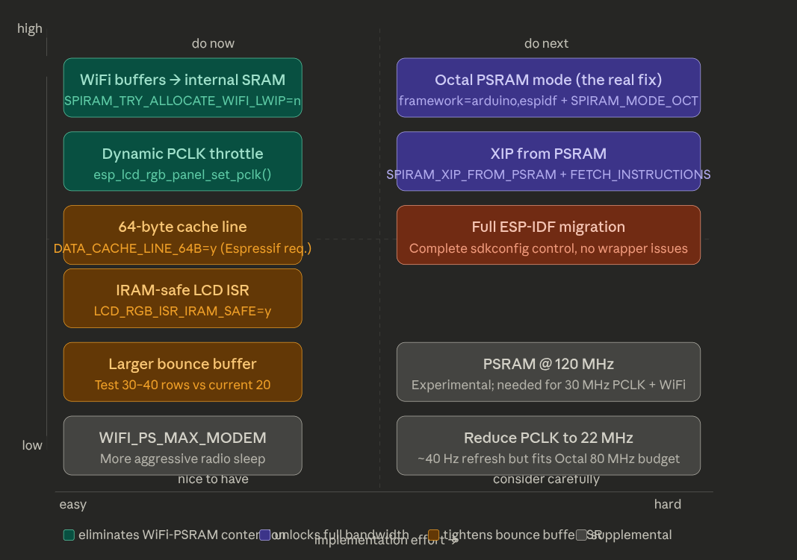

# ESP32-S3 WiFi + RGB LCD Jitter — Research Findings

Consolidated research from four independent AI agents (Gemini, Perplexity, Claude,
ChatGPT) on the jitter problem documented in `ESP32-S3-WIFI-LCD-JITTER.md`.
Each agent was given the original document and asked to research the 7 open
questions. Their findings converge strongly on the same root cause and solution.

**Date**: 2026-03-28

---

## The Smoking Gun: PCLK Exceeds Safe Limit by 3x

All four agents independently surfaced the same critical datapoint from
Espressif's LCD FAQ that reframes the entire problem:

> "Based on limited testing, for Quad PSRAM at 80 MHz, the highest PCLK setting
> is around **11 MHz**; for Octal PSRAM at 80 MHz, the highest PCLK setting is
> around **22 MHz**; for Octal PSRAM at 120 MHz, the highest PCLK setting is
> around **30 MHz**."
>
> — Espressif ESP-FAQ, LCD documentation

Arturo runs at **30 MHz PCLK** with what is effectively **Quad PSRAM at 80 MHz**
(due to the pre-compiled Arduino framework defaulting to `CONFIG_SPIRAM_MODE_QUAD`
despite OPI hardware). That is **nearly 3x the experimentally confirmed safe
maximum** for this PSRAM configuration.

This means:
- The software mitigations already applied (bounce buffers, modem sleep, task
  isolation) are real improvements, but they cannot fix a system operating
  outside its bandwidth envelope
- The bandwidth calculation in the original doc used Octal figures (~120 MB/s);
  the actual Quad bandwidth is ~60 MB/s, meaning display alone (73 MB/s)
  **exceeds the bus capacity**
- This is not a software tuning problem — it is a hardware misconfiguration

### PCLK Budget Table

| PSRAM Config | Theoretical BW | Espressif Max PCLK | Arturo PCLK | Status |
|---|---|---|---|---|
| Quad 80 MHz | ~60 MB/s | ~11 MHz | 30 MHz | **3x over limit** |
| Octal 80 MHz | ~120 MB/s | ~22 MHz | 30 MHz | 1.4x over limit |
| Octal 120 MHz | ~180 MB/s | ~30 MHz | 30 MHz | At limit |

---

## Solution Landscape



**Legend**: Green = eliminates WiFi-PSRAM contention, Blue = unlocks full
bandwidth, Orange = tightens bounce buffer path, White = supplemental

**Top-left quadrant (high impact, do now)**:
- WiFi buffers to internal SRAM (`SPIRAM_TRY_ALLOCATE_WIFI_LWIP=n`)
- Dynamic PCLK throttle (`esp_lcd_rgb_panel_set_pclk()`)
- 64-byte cache line (`DATA_CACHE_LINE_64B=y` — Espressif **requirement**)
- IRAM-safe LCD ISR (`LCD_RGB_ISR_IRAM_SAFE=y`)
- Larger bounce buffer (test 30-40 rows)

**Top-right quadrant (high impact, do next)**:
- Octal PSRAM mode (`framework=arduino,espidf` + `SPIRAM_MODE_OCT`)
- XIP from PSRAM (`SPIRAM_XIP_FROM_PSRAM` + `FETCH_INSTRUCTIONS`)
- Full ESP-IDF migration (complete sdkconfig control)

**Lower quadrants (supplemental)**:
- PSRAM @ 120 MHz (experimental; needed for 30 MHz PCLK + WiFi)
- `WIFI_PS_MAX_MODEM` (more aggressive radio sleep)
- Reduce PCLK to 22 MHz (~40 Hz refresh, fits Octal 80 MHz budget)

---

## Research Question Answers

### Q1: Is `CONFIG_SPIRAM_MODE_OCT` the missing piece?

**Consensus: Yes — it is the foundational fix, not optional.**

All four agents agree this is the single most important configuration change.
The PSRAM mode must match the hardware. Waveshare's own documentation for the
ESP32-S3-Touch-LCD-7B specifies "8 MB OPI mode." The pre-compiled Arduino
framework ignores this and defaults to Quad.

- Switching from Quad to Octal roughly **doubles available bandwidth** (60 → 120 MB/s)
- Espressif's own RGB panel example for ESP32-S3 uses `CONFIG_SPIRAM_MODE_OCT=y`
- A confirmed PlatformIO community post shows `framework = arduino, espidf` with
  `CONFIG_SPIRAM_MODE_OCT=y` successfully activating OPI bus mode
- However, Octal at 80 MHz only supports ~22 MHz PCLK per Espressif's testing —
  still below Arturo's 30 MHz. Either reduce PCLK to 22 MHz or also enable
  120 MHz PSRAM speed

**The `custom_sdkconfig` + `__wrap_log_printf` blocker is well-understood**: the
pre-compiled Arduino WiFi `.a` blobs were built against a specific ESP-IDF
configuration, and any change to PSRAM mode alters linker-level symbol wrapping,
breaking compatibility. There is no clean workaround within the pure Arduino
framework path.

### Q2: Does `CONFIG_SPIRAM_TRY_ALLOCATE_WIFI_LWIP=n` eliminate WiFi DMA on the PSRAM bus?

**Consensus: Yes — this is the highest-leverage quick fix.**

When set, WiFi/LwIP packet buffers move entirely to internal SRAM. No WiFi DMA
touches the PSRAM bus. The cost is ~50-100 KB of internal SRAM, which the
ESP32-S3's 320 KB SRAM can absorb.

Espressif's LCD FAQ explicitly recommends disabling this setting if screen drift
occurs with WiFi active.

**Critical unknown**: Whether this sdkconfig option triggers the
`__wrap_log_printf` linker error. Unlike PSRAM mode changes, WiFi buffer
placement shouldn't alter symbol wrapping. **Worth testing in isolation before
anything else** — if this builds successfully under the current Arduino
framework, it could provide the biggest single improvement without a framework
migration.

Also watch:
- `CONFIG_SPIRAM_ALLOW_BSS_SEG_EXTERNAL_MEMORY` — can place other allocations
  in PSRAM, potentially reintroducing contention
- Internal memory reserve settings — ensure enough SRAM remains for DMA and
  other internal-only consumers

### Q3: What do commercial products and Espressif's own reference boards do?

**Consensus: No magic hidden switch — they use the documented stack correctly.**

The Espressif ESP-BSP for the **ESP32-S3-LCD-EV-Board** explicitly identifies
bounce buffer mode as the recommended fix for WiFi + LCD coexistence:

> "Enabling bounce buffer mode can lead to a higher PCLK frequency at the
> expense of increased CPU consumption. This mode is particularly useful when
> dealing with screen drift, especially in scenarios involving Wi-Fi usage or
> writing to Flash memory. This feature should be used in conjunction with
> `ESP32S3_DATA_CACHE_LINE_64B` configuration."
>
> — ESP-BSP GitHub repository

The pattern from Espressif's own boards and examples:
- Octal PSRAM (always)
- XIP from PSRAM (always for RGB LCD)
- Bounce buffer mode with 64-byte cache lines (always)
- Board support built on ESP-IDF/esp-bsp (not pre-compiled Arduino)
- `CONFIG_COMPILER_OPTIMIZATION_PERF=y` (-O2, not -Os)

The ESP32-S3-LCD-EV-Board example notes:
> "The PSRAM 120M DDR feature is intended to achieve the best performance of RGB LCD."

### Q4: Is `framework = espidf, arduino` (hybrid mode) a viable path?

**Consensus: Yes — this is the recommended migration path.**

All agents converge on hybrid mode as the best middle ground:
- Preserves Arduino APIs (WiFi.h, Serial, etc.)
- ESP-IDF compiled from source alongside Arduino — eliminates the pre-compiled
  library linker conflict
- Full sdkconfig control via `sdkconfig.defaults`
- Confirmed working in community posts for ESP32-S3-DevKitC-1-N16R8 with
  Octal PSRAM

**Migration cost**: Moderate. Main changes:
- `platformio.ini`: `framework = arduino, espidf`
- Add `sdkconfig.defaults` file with all PSRAM/LCD settings
- Add pre-build script for dummy certificate files (one-time fix)
- Some Arduino APIs may need minor adjustments

**Certificate file fix**: The HTTPS server and ESP Rainmaker components require
`.crt.S` assembly files during build. A pre-build script creates dummy files:

```python
# pre_build.py (add to extra_scripts in platformio.ini)
import os, pathlib

def create_dummy_certs(source, target, env):
    build_dir = env.subst("$BUILD_DIR")
    certs = [
        "https_server.crt.S",
        "rmaker_mqtt_server.crt.S",
        "rmaker_claim_service_server.crt.S",
        "rmaker_ota_server.crt.S",
    ]
    for cert in certs:
        p = pathlib.Path(build_dir) / cert
        p.parent.mkdir(parents=True, exist_ok=True)
        if not p.exists():
            p.write_text("/* dummy */\n")

env = DefaultEnvironment()
env.AddPreAction("$BUILD_DIR/src", create_dummy_certs)
```

**Alternative paths** (less recommended):
- Rebuild Arduino core from source with Static Library Builder
- Full ESP-IDF migration (highest effort, cleanest result)
- Patch pre-compiled `.a` files (fragile, fights the toolchain)

### Q5: Can the bounce buffer ISR path be made faster?

**Consensus: Yes — through four specific settings.**

1. **`CONFIG_LCD_RGB_ISR_IRAM_SAFE=y`** — Keeps the ISR in IRAM so flash cache
   misses cannot stall it. Espressif's FAQ explicitly lists this as a fix for
   screen drift during flash operations.

2. **`CONFIG_ESP32S3_DATA_CACHE_LINE_64B=y`** — Larger cache lines mean the CPU
   fetches more PSRAM data per cache transaction, reducing round-trips in the
   bounce buffer copy loop. **This is not an optimization — Espressif states it
   is required for bounce buffer mode to work correctly.** The current 32B
   setting combined with bounce buffer mode is the Espressif-documented cause
   of screen drift.

3. **`CONFIG_COMPILER_OPTIMIZATION_PERF=y`** — `-O2` instead of `-Os` generates
   faster memcpy code. Specifically benefits the bounce buffer ISR inner loop.

4. **XIP from PSRAM** — Eliminates flash cache misses entirely during ISR
   execution by running code from PSRAM instead of flash.

**Important correction to original document**: The `DATA_CACHE_LINE_64B` entry
in the "What Should Be Set" table understates its importance. It is listed as
"larger cache lines = efficient PSRAM->SRAM copy" but actually Espressif states
that **bounce buffer mode requires 64B cache lines**. The current 32B setting
is a correctness bug, not a performance optimization opportunity.

### Q6: Is there an ESP-IDF GDMA priority mechanism for LCD over WiFi?

**Consensus: No public API exists. Do not pursue this path.**

The ESP32-S3 GDMA controller has internal arbitration priority and
`GDMA_CHn_PRI` / `rx_weight` / `tx_weight` registers exist in hardware, but:

- No public API in ESP-IDF 5.x exposes GDMA channel priority
- Espressif forum: "The only way to solve this would be some sort of hardware
  priority schemes which allow GDMA to complete its job without being
  interrupted." — confirming no software solution exists
- HAL-level register writes are theoretically possible but fragile and
  unsupported
- Even if LCD GDMA priority were elevated, WiFi DMA would stall instead,
  potentially causing network throughput drops

**One agent (Gemini) suggested direct register manipulation** to set LCD DMA
priority to maximum (3) and WiFi to minimum (0-1). While technically possible,
all other agents and Espressif's own guidance recommend against this approach
as unsupported and fragile.

### Q7: Does ESP-IDF 5.5+ have new LCD+WiFi coexistence features?

**Consensus: No single new "coexistence" switch, but useful runtime APIs exist.**

New/improved APIs in ESP-IDF 5.5+:

- **`esp_lcd_rgb_panel_set_pclk()`** — Dynamic pixel clock adjustment at
  runtime. Espressif explicitly recommends using this to throttle PCLK during
  WiFi-heavy operations: reduce to ~6-10 MHz before the operation, delay ~20 ms
  for one frame, then restore. Causes a brief blank flash but prevents permanent
  drift.

- **`dma_burst_size` field** in `esp_lcd_rgb_panel_config_t` — Replaces
  deprecated `sram_trans_align` / `psram_trans_align`. Should be set to 64 for
  optimal alignment with 64B cache lines.

- **`refresh_on_demand` flag** — Defers LCD refresh to explicit calls. Could
  batch display updates to known-quiet WiFi windows.

- **`no_fb` mode** — Bounce-buffer-only with no framebuffer. Reduces PSRAM
  usage but requires the application to render into bounce buffers directly.

The current docs lean harder on the modern RGB driver modes and runtime controls
as the intended toolbox, rather than adding a single magic coexistence flag.

---

## Recommended sdkconfig for Waveshare ESP32-S3-Touch-LCD-7B

All four agents converge on essentially the same target configuration. This
represents the consensus "correct" settings for WiFi + RGB LCD on this board:

```ini
# PSRAM — match the OPI hardware
CONFIG_SPIRAM=y
CONFIG_SPIRAM_MODE_OCT=y
# CONFIG_SPIRAM_MODE_QUAD is not set
CONFIG_SPIRAM_SPEED_80M=y                    # Start here; 120M is experimental
CONFIG_IDF_EXPERIMENTAL_FEATURES=y           # Required for OCT mode

# XIP — eliminate flash/PSRAM bus sharing
CONFIG_SPIRAM_XIP_FROM_PSRAM=y
CONFIG_SPIRAM_FETCH_INSTRUCTIONS=y
CONFIG_SPIRAM_RODATA=y

# Cache — required for bounce buffer correctness
CONFIG_ESP32S3_DATA_CACHE_LINE_64B=y
# CONFIG_ESP32S3_DATA_CACHE_LINE_32B is not set
CONFIG_ESP32S3_DATA_CACHE_64KB=y
CONFIG_ESP32S3_INSTRUCTION_CACHE_32KB=y

# LCD — protect the ISR
CONFIG_LCD_RGB_ISR_IRAM_SAFE=y

# WiFi — keep DMA off PSRAM bus
# CONFIG_SPIRAM_TRY_ALLOCATE_WIFI_LWIP is not set

# Compiler — faster bounce buffer memcpy
CONFIG_COMPILER_OPTIMIZATION_PERF=y
# CONFIG_COMPILER_OPTIMIZATION_SIZE is not set
```

### Settings NOT in the consensus (consider later)

| Setting | Why deferred |
|---|---|
| `CONFIG_SPIRAM_SPEED_120M=y` | Experimental, temperature-sensitive. Test after Octal 80 MHz is stable. |
| `CONFIG_SPIRAM_ALLOW_BSS_SEG_EXTERNAL_MEMORY` | Can reintroduce PSRAM contention. Leave off unless needed. |
| GDMA priority registers | No public API, unsupported. |

---

## Key Corrections to Original Document

1. **`DATA_CACHE_LINE_64B` is a correctness requirement, not an optimization.**
   Espressif states bounce buffer mode requires 64B cache lines. The current
   32B setting is the documented cause of screen drift in bounce buffer mode.

2. **Bandwidth calculation uses wrong figures.** The original doc calculates
   using Octal PSRAM bandwidth (~120 MB/s theoretical). With Quad mode active,
   actual usable bandwidth is ~60 MB/s. Display alone at 73 MB/s **exceeds**
   the bus capacity — the system is technically in bus starvation every frame.

3. **PCLK is the critical variable, not just bandwidth percentage.** Espressif's
   FAQ provides concrete PCLK limits per PSRAM configuration. At 30 MHz PCLK
   with Quad 80 MHz PSRAM, the system is 3x over the tested safe limit.

---

## What to Stop Spending Time On

All agents agree these paths are low-value:

1. **More mutex/task-priority tuning** — Espressif's docs do not present this
   as the root solution. The current task layout is already good.

2. **`CONFIG_LCD_RGB_RESTART_IN_VSYNC` as a fix** — It is a recovery mechanism,
   not a prevention mechanism. Espressif explicitly says it "cannot completely
   avoid the issue."

3. **Patching pre-compiled Arduino `.a` files** — Fights the toolchain instead
   of using it. Every framework update breaks the patches.

4. **GDMA priority register hacking** — No public API, unsupported, fragile.

5. **LVGL rendering optimizations beyond what's already done** — The current
   LVGL setup (active-tab-only, fixed positioning, disabled perf monitor) is
   already well-optimized. Further LVGL tuning yields diminishing returns
   against a hardware bandwidth problem.

---

## Agent Agreement Matrix

| Finding | Gemini | Perplexity | Claude | ChatGPT |
|---|---|---|---|---|
| Octal PSRAM is foundational | Yes | Yes | Yes | Yes |
| WiFi buffers to SRAM is highest quick win | Yes | Yes | Yes | Yes |
| 64B cache line is required (not optional) | — | — | Yes | Yes |
| Hybrid framework is best migration path | Yes | — | Yes | Yes |
| No GDMA priority API exists | Yes | — | Yes | Yes |
| PCLK 30 MHz exceeds Quad safe limit | — | — | Yes | Yes |
| 120 MHz PSRAM should be deferred | — | Yes | Yes | Yes |
| Dynamic PCLK throttle is useful | Yes | — | Yes | Yes |
| Pre-build script solves cert blocker | Yes | — | — | — |
| Espressif recommends bounce buffer + 64B + XIP | — | Yes | Yes | Yes |

---

## Sources Referenced by Agents

- Espressif ESP-FAQ LCD documentation (PCLK limits per PSRAM configuration)
- ESP-IDF RGB LCD driver documentation (bounce buffer, XIP, ISR safety)
- ESP-BSP GitHub repository (ESP32-S3-LCD-EV-Board support package)
- ESP-IDF `examples/peripherals/lcd/rgb_panel` (reference sdkconfig)
- PlatformIO Community (hybrid framework + Octal PSRAM confirmation)
- Espressif ESP32 Forum (GDMA priority discussion)
- Waveshare ESP32-S3-Touch-LCD-7B documentation (OPI PSRAM specification)
- ESP-IDF Kconfig reference (SPIRAM, LCD, cache configuration options)
